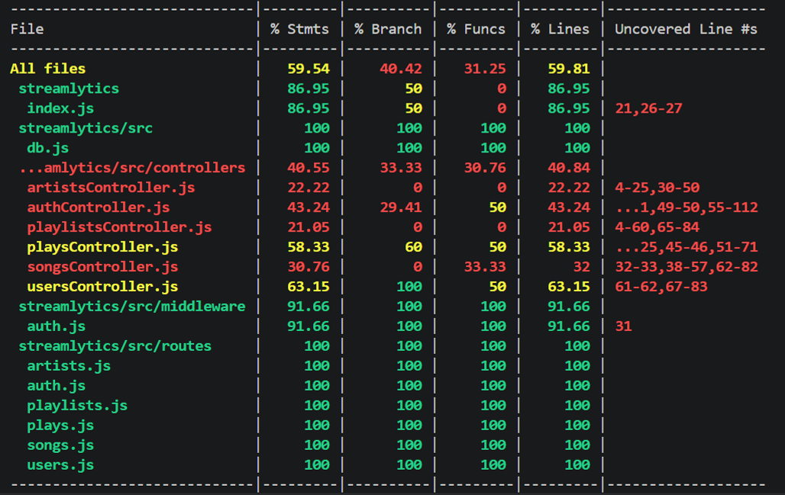

# Streamlytics 🎵

A music analytics REST API built with Node.js, Express, and PostgreSQL — inspired by the kind of data infrastructure that powers platforms like Spotify.

**Live API:** https://streamlytics-production.up.railway.app

---

## Tech Stack

- **Runtime:** Node.js 22
- **Framework:** Express.js
- **Database:** PostgreSQL 16
- **Authentication:** JWT (JSON Web Tokens)
- **Containerization:** Docker + Docker Compose
- **Deployment:** Railway

---

## Features

- REST API with 11 endpoints across 5 route modules
- Advanced SQL analytics using Window Functions, CTEs, and aggregations
- JWT authentication with bcrypt password hashing
- Parameterized queries for SQL injection protection
- Dockerized app + database with health checks
- Seed data and schema managed via SQL init files

---

## API Endpoints

### Artists
| Method | Endpoint | Description |
|--------|----------|-------------|
| GET | `/artists/top` | Top artists by total plays (supports `?limit=N`) |
| GET | `/artists/:id` | Artist details with total songs and plays |

### Songs
| Method | Endpoint | Description |
|--------|----------|-------------|
| GET | `/songs/trending` | Trending songs ranked by recent plays (window function) |
| GET | `/songs/search?q=` | Search songs or artists (case-insensitive) |
| GET | `/songs/:id` | Song details with artist info |

### Users
| Method | Endpoint | Description |
|--------|----------|-------------|
| GET | `/users` | All users ranked by total plays |
| GET | `/users/:id/stats` | Full listening stats: favorite genre, artist, total time |

### Playlists
| Method | Endpoint | Description |
|--------|----------|-------------|
| GET | `/playlists` | All playlists with owner and song count |
| GET | `/playlists/:id/insights` | Playlist analytics: duration, popularity, top genre |

### Plays
| Method | Endpoint | Description |
|--------|----------|-------------|
| GET | `/plays/recent` | 10 most recent play events |
| POST | `/plays` | Log a new play event 🔒 (requires JWT) |

### Auth
| Method | Endpoint | Description |
|--------|----------|-------------|
| POST | `/auth/register` | Register a new user, returns JWT token |
| POST | `/auth/login` | Login, returns JWT token |

---

## Getting Started Locally

### Prerequisites
- Node.js 22+
- PostgreSQL 16+
- Docker (optional)

### With Docker (recommended)
```bash
git clone https://github.com/tehila-raviv/streamlytics.git
cd streamlytics
docker-compose up --build
```

The API will be available at `http://localhost:3000`.

### Without Docker
```bash
git clone https://github.com/tehila-raviv/streamlytics.git
cd streamlytics
npm install
cp .env.example .env
# Fill in your .env values
psql -U postgres -d spotify_clone -f init/01_schema.sql
psql -U postgres -d spotify_clone -f init/02_seed.sql
npm run dev
```

---
## 🧪 Quality Assurance & Testing
This project maintains high reliability through a comprehensive test suite:
- **Unit Testing (Jest + Supertest):** Covering critical paths including Authentication flow and complex Data Analytics.
- **Database Abstraction:** Using **Manual Mocks** for PostgreSQL queries to ensure consistent test environments.
- **Edge Case Coverage:** Validating error states, missing entities, and security (JWT) constraints.
- **Coverage Report:** Detailed breakdown of test metrics below.



> _**Summary:** Achieved 91.66% coverage on critical security middleware and robust testing for complex SQL analytics endpoints._

---

## Example Requests

**Get top 3 artists:**

GET https://streamlytics-production.up.railway.app/artists/top?limit=3

**Get trending songs:**

GET https://streamlytics-production.up.railway.app/songs/trending

**Get user listening stats:**

GET https://streamlytics-production.up.railway.app/users/1/stats

**Log a play (authenticated):**

POST https://streamlytics-production.up.railway.app/plays
Authorization: Bearer <your_token>
Body: { "user_id": 1, "song_id": 3, "duration_played": 198 }

---

## Database Schema

6 tables: `users`, `artists`, `songs`, `playlists`, `playlist_songs`, `plays`

Notable SQL features used:
- `RANK() OVER (PARTITION BY ...)` — ranking songs within each artist
- `WITH` CTEs — multi-step analytics queries
- `MODE() WITHIN GROUP` — finding favorite genre/artist per user
- `COALESCE` — null-safe aggregations
- `ILIKE` — case-insensitive search

---

## Author

Tehila Raviv - [LinkedIn](https://www.linkedin.com/in/tehila-raviv/) · [GitHub](https://github.com/tehila-raviv)
